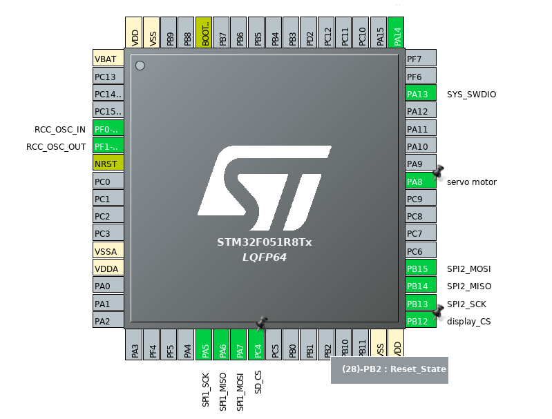

# FRM-45
ECE362 Project 1 Drawing Machine  

Stepper and Servo Motors  
[SD Card Programming](https://github.com/Andrew-Gan/frm-45/tree/second)  
[Image Processing](https://github.com/Andrew-Gan/frm-45/tree/master/Image_Processing)

## Used Pins
* **PA8** - _servomotor_  
* **PA5-7** and **PC9** - _sd card reader_
* **PA12-15**  - _OLED display_

## References
* [CoreXY CNC Plotter](https://www.instructables.com/id/CoreXY-CNC-Plotter/?fbclid=IwAR0pwp5_IWx3ZKXX_-JnrqQA2Jc5w_0K_mVkKk8bpvbu7aeOSSTUAUPy2AY) 
* [How to read GCode](https://makezine.com/2016/10/24/get-to-know-your-cnc-how-to-read-g-code/?fbclid=IwAR3-w1awEFc9UalxPZxf2Twn3zoppbnQXDNl3gHNShbNhc7IxlubZtNi5JA)
* [Gcode Reference](https://www.cnccookbook.com/g-code-m-code-reference-list-cnc-mills/)
* [Another website about how to make gcode](https://www.marginallyclever.com/2013/08/how-to-build-an-2-axis-arduino-cnc-gcode-interpreter/?fbclid=IwAR2Cuwl6wh2F5Wqw8JK4fef5dCa7CKCwGwoWh0Y8hn-iv6d_DvxPZTSHs24)

