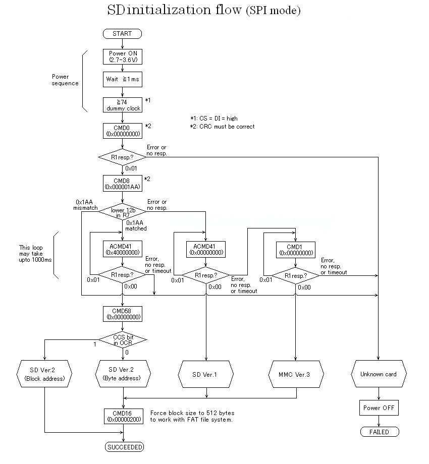

# FRM-45
- [ECE362 Project 1 Drawing Machine](/Plotter)  
Program a [plotter](https://www.banggood.com/EleksMaker-EleksDraw-XY-Plotter-Pen-Drawing-Writing-Robot-Drawing-Machine-p-1125222.html?akmClientCountry=America&p=IB170413294898201708&utm_campaign=13294898_1125222&utm_content=1497&cur_warehouse=USA) that can move to the coordinates specified in SD Card

- team: [kroghm96](https://github.com/kroghm96), [lauchokyip](https://gitlab.com/lauchokyip), Ryan

## Development Environment
- [System Workbench](https://www.st.com/en/development-tools/sw4stm32.html)

## MCU
- [STM32F0DISCOVERY](https://www.st.com/en/evaluation-tools/stm32f0discovery.html)

## Used Pins
* **PA8** - _servomotor_  
* **PA4-7** - _sd card reader_
* **PB12-15**  - _OLED display_
* **PA0,PA2**  - _Scroll and select (EXTI)_
* **PC4-7** - _Directional buttons (EXTI)_

## SD Card and OLED References
- [Reading For SD Card](http://shukra.cedt.iisc.ernet.in/edwiki/Reading_and_writing_to_a_file_on_sd_card_using_stm32_discovery_kit)
- [Example from book](https://docs.google.com/file/d/0B8buOhyZhvwZRU9XWHBpYUYyUnc/edit)
- [Open Source Library](http://elm-chan.org/fsw/ff/00index_e.html)
- [I/O Pin Setup](https://sites.google.com/site/embeddedfun01/fat-filesystem-on-sd-card)
- [SPI and SD Cards reading](http://www.dejazzer.com/ee379/lecture_notes/lec12_sd_card.pdf)
- [FRM 745](https://engineering.purdue.edu/ece362/refs/STM32F0x1_Family_Reference.pdf#%5B%7B%22num%22%3A6629%2C%22gen%22%3A0%7D%2C%7B%22name%22%3A%22XYZ%22%7D%2C67%2C226%2Cnull%5D)
- [Standard Peripheral Library Manual](https://www.st.com/content/ccc/resource/technical/document/user_manual/59/2d/ab/ad/f8/29/49/d6/DM00023896.pdf/files/DM00023896.pdf/jcr:content/translations/en.DM00023896.pdf)
- [Another example of STM32 of SD card](https://stm32f4-discovery.net/2014/07/library-21-read-sd-card-fatfs-stm32f4xx-devices/)
- [SPI presentation from STM](https://www.st.com/content/ccc/resource/training/technical/product_training/group0/3e/ee/cd/b7/84/4b/45/ee/STM32F7_Peripheral_SPI/files/STM32F7_Peripheral_SPI.pdf/_jcr_content/translations/en.STM32F7_Peripheral_SPI.pdf)

  
## GCode References
| G-code | Arg 1 | Arg 2 | Description                     |
|--------|-------|-------|---------------------------------|
| G00    | X     | Y     | Relocate pen while raised       |
| G01    | X     | Y     | Linearly move pen while dropped |
| G90    | -     | -     | Switch to absolute coordinates  |
| G91    | -     | -     | Switch to relative coordinates  |
* [Data Sheet for A4988](https://www.digchip.com/datasheets/parts/datasheet/029/A4988-pdf.php)
* [CoreXY CNC Plotter](https://www.instructables.com/id/CoreXY-CNC-Plotter/?fbclid=IwAR0pwp5_IWx3ZKXX_-JnrqQA2Jc5w_0K_mVkKk8bpvbu7aeOSSTUAUPy2AY) 
* [How to read GCode](https://makezine.com/2016/10/24/get-to-know-your-cnc-how-to-read-g-code/?fbclid=IwAR3-w1awEFc9UalxPZxf2Twn3zoppbnQXDNl3gHNShbNhc7IxlubZtNi5JA)
* [Gcode Reference](https://www.cnccookbook.com/g-code-m-code-reference-list-cnc-mills/)
* [GCode G02 G03](https://www.cnccookbook.com/cnc-g-code-arc-circle-g02-g03/)  
* [Servomotor with STM32](https://controllerstech.com/servo-motor-with-stm32/)  
* [Another website about how to make gcode](https://www.marginallyclever.com/2013/08/how-to-build-an-2-axis-arduino-cnc-gcode-interpreter/?fbclid=IwAR2Cuwl6wh2F5Wqw8JK4fef5dCa7CKCwGwoWh0Y8hn-iv6d_DvxPZTSHs24)
* [Bresenham's line algorithm to draw a line between 2 points](https://en.wikipedia.org/wiki/Bresenham%27s_line_algorithm)

